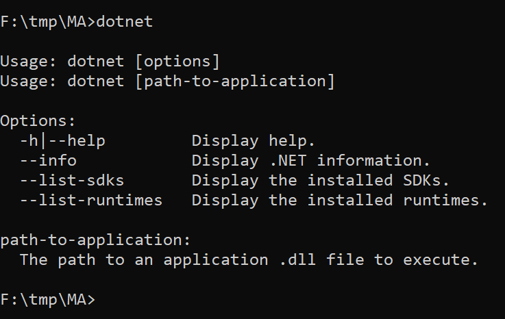
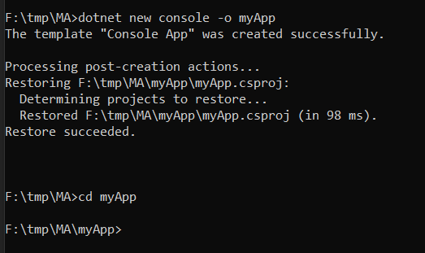
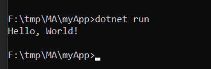
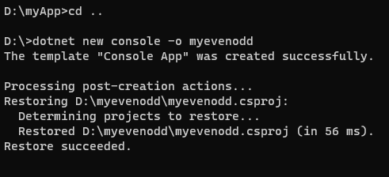
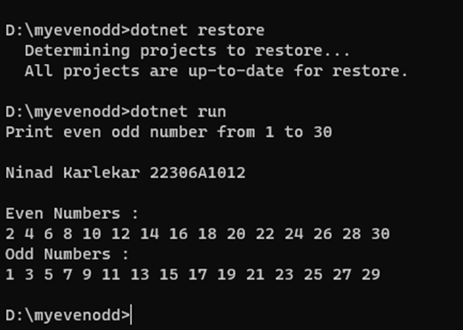

**MSc (IT) Sem-II** <br>
**Microservice Architecture** <br>
**Practical #1** <br>
**Building First Console App**


***.Net SDK Download Link:***
<br>
https://dotnet.microsoft.com/learn/dotnet/hello-world-tutorial/install

Steps:

1. Download and install
- To start building .NET apps you just need to download and install the .NET SDK (Software Development Kit).

2. Check everything installed correctly
- Once you've installed, open a new command prompt and run the following command:
    ```
    dotnet
    ```

- 

3. Create your app
- In your command prompt, run the following commands:
    ```
    dotnet new console -o myApp
    ```
    ```
    cd myApp
    ```

- 

- The main file in the myApp folder is Program.cs. By default, it already contains the necessary code to write "Hello World!" to the Console.

- `Program.cs` Code

    ```cs
    using System;
    namespace myApp
    {
        class Program
        {
            static void Main(string[] args)
            {
                Console.WriteLine("Hello World!");
            }
        }
    }
    ```

4. Run your app
- In your command prompt, run the following command:
    ```
    dotnet run
    ```
- 


5. To Change Content/output of program open `Program.cs` and do necessary changes

6. After Changes save file and in ***CMD*** run following command to ***restore changes***
    ```
    dotnet restore
    ```
<br>

********************

## Print even odd number from 1 to 30

Code:

```cs
using System;
using System.Collections.Generic;
using System.Linq;
using System.Text;

namespace myevenodd
{    
    class Program
    {
        static void Main(string[] args)
        {
            int i     = 0;
		    Console.WriteLine("Print even odd number from 1 to 30");
		    Console.WriteLine("\nNinad Karlekar 22306A1012");

            Console.WriteLine("\nEven Numbers :");
            for (i = 1; i <= 30; i++)
            {   
                if( i%2 == 0 )
                {
                    Console.Write(i + " ");
                }
            }
            Console.WriteLine("\nOdd Numbers :");
            for (i = 1; i <= 30; i++)
            {
                if (i % 2 != 0)
                {
                    Console.Write(i + " ");
                }
            }
            Console.WriteLine();
        }
    }
}
```

- OUTPUT





